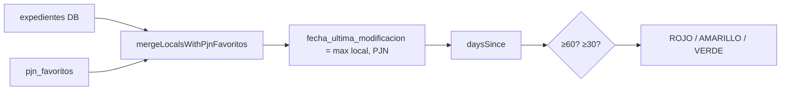
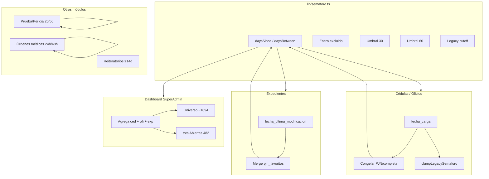

# Semáforos del sistema — documentación exhaustiva

> **Proyecto:** gestor-cedulas  
> **Última revisión:** junio 2026 (auditoría código + dashboard SuperAdmin)  
> **Alcance:** todos los mecanismos de color VERDE / AMARILLO / ROJO (y variantes) en la plataforma.

---

## 1. Resumen ejecutivo

El semáforo **no es una sola regla global**. Es un **conjunto de reglas paralelas** según el tipo de documento y la pantalla:

| Dominio | Unidad medida | Umbrales típicos | ¿Reloj congelado? |
|---------|---------------|------------------|-------------------|
| **Expedientes** | Días desde última modificación | 0–29 / 30–59 / 60+ | No |
| **Cédulas y oficios** | Días desde fecha de carga | 0–29 / 30–59 / 60+ | Sí (en Mis Cédulas, al completar/PJN) |
| **Prueba / Pericia** | Días desde última actividad | 0–19 / 20–49 / 50+ | Sí (renuncia) |
| **Órdenes médicas** | Horas sin contacto (activo) o días (estudio/renuncia) | 24h / 48h (+ turno vencido) | Sí (estudio realizado, renuncia) |
| **Reiteratorios** | Días desde carga PJN | Umbral operativo ≥14 días (no es semáforo tricolor en UI) | N/A |

**Regla de oro para interpretar números:** siempre preguntar *qué pantalla*, *qué tipo de documento* y *qué fecha base* usa ese cálculo. El dashboard SuperAdmin **agrega** cédulas + oficios + expedientes con reglas **no idénticas** a las de cada listado operativo.

---

## 2. Glosario

| Término | Significado |
|---------|-------------|
| **Semáforo** | Estado visual de urgencia: `VERDE`, `AMARILLO`, `ROJO`. |
| **Fecha base** | Fecha desde la cual corre el reloj de antigüedad. |
| **Días efectivos** | Días calendario **menos días de enero** (feria judicial). Ver `lib/semaforo.ts`. |
| **Merge PJN** | Enlace expediente local ↔ favorito PJN; actualiza `fecha_ultima_modificacion` con la más reciente. |
| **Legacy clamp** | Cédulas con `fecha_carga` anterior a una fecha de corte **nunca** se muestran ROJO (máximo AMARILLO). |
| **Reloj congelado** | Los días dejan de contarse hacia adelante en una fecha fija (completada, PJN, renuncia, etc.). |
| **`totalAbiertas`** | En dashboard: solo **cédulas + oficios** abiertos (`cedulas.length`), **sin** expedientes. |
| **Universo semáforo dashboard** | Suma de conteos por color: cédulas + oficios + expedientes (p. ej. 390+277+427 = **1094**). |

---

## 3. Fundamentos compartidos (`lib/semaforo.ts`)

Archivo canónico para utilidades de tiempo. Varias pantallas **duplican** la función `semaforoByAge` localmente con los mismos umbrales 30/60; el cálculo de días debería preferir importar desde aquí.

### 3.1 Umbrales estándar (expedientes, cédulas, oficios en la mayoría de pantallas)

```ts
UMBRAL_AMARILLO_DIAS = 30  // desde 30 días inclusive → AMARILLO
UMBRAL_ROJO_DIAS     = 60  // desde 60 días inclusive → ROJO
```

| Días efectivos | Color |
|----------------|-------|
| 0 – 29 | VERDE |
| 30 – 59 | AMARILLO |
| ≥ 60 | ROJO |

### 3.2 Cálculo de días (`daysSince`)

1. Parsea la fecha ISO de inicio.
2. Calcula días calendario hasta **hoy** (inicio de día local).
3. Recorre el rango y **resta un día por cada día de enero** (mes 0 en JS).
4. Retorna `max(0, totalDays - eneroDays)`.

**Efecto:** enero no cuenta para el plazo. Una causa que cruza enero acumula menos días efectivos que días calendario.

### 3.3 Cálculo entre dos fechas (`daysBetween`)

Misma lógica de exclusión de enero, pero entre **fecha inicio** y **fecha fin** (no “hoy”). Usado cuando el reloj está congelado.

### 3.4 Helper `colorFromFechaCarga`

Atajo: `daysSince` + umbrales 30/60. Usado donde la fecha base es siempre `fecha_carga`.

### 3.5 Regla legacy (`isLegacySemaforoDate`)

Variable de entorno: `NEXT_PUBLIC_SEMAFORO_LEGACY_CUTOFF_DATE` (formato `YYYY-MM-DD`).

Si la fecha de carga es **≤ fecha de corte**, el registro se considera “histórico”. En pantallas que aplican `clampLegacySemaforo`:

- Si el semáforo calculado sería **ROJO** → se muestra **AMARILLO**.
- VERDE y AMARILLO no cambian.

**Objetivo de negocio:** no marcar en rojo cargas antiguas del sistema previo al corte.

---

## 4. Semáforo de expedientes

### 4.1 Regla de negocio

- **Fecha base:** `fecha_ultima_modificacion` (ISO).
- **Fallback** (solo en algunas pantallas): si no hay modificación, `fecha_ultima_carga` del favorito PJN (formato DD/MM/AAAA convertido a ISO).
- **Sin fecha válida:** en listados suele mostrarse **VERDE** por defecto (no se puede calcular antigüedad).
- **Umbrales:** 30 / 60 días efectivos (estándar).
- **Reloj:** corre siempre; un movimiento que actualice `fecha_ultima_modificacion` **reinicia** el contador hacia verde.

### 4.2 Merge PJN (`lib/expediente-pjn-merge.ts`)

Antes de calcular el semáforo, **Mis Juzgados** y **Dashboard SuperAdmin** (desde fix jun-2026) unifican datos:

1. Matchea expediente local con `pjn_favoritos` por clave `JURISDICCIÓN|NÚMERO|AÑO`.
2. Completa juzgado, carátula, observaciones si están vacíos en local.
3. **`pickNewerIsoDate`:** elige la fecha **más reciente** entre:
   - `expedientes.fecha_ultima_modificacion`
   - `pjn_favoritos.fecha_ultima_carga` (convertida a ISO)
4. **`dedupeExpedientesByMatchKey`:** evita dos filas del mismo expediente (local + favorito).

**Flag de rollback:** `NEXT_PUBLIC_EXPEDIENTE_PJN_MERGE=0` desactiva merge; vuelve al comportamiento de concatenar por `id`.



### 4.3 Cuándo un expediente sale de ROJO

| Transición | Condición |
|------------|-----------|
| ROJO → AMARILLO | Días efectivos bajan a 30–59 porque **se actualizó** `fecha_ultima_modificacion` (movimiento PJN más reciente vía merge o carga manual). |
| AMARILLO → VERDE | Misma fecha base con antigüedad &lt; 30 días efectivos. |
| Solo el paso del tiempo | **No alcanza** para bajar de rojo si la fecha base no cambia (los días solo suben). |

**Caso auditado (Juzgado Civil 20):** el listado Mis Juzgados mostraba 1 rojo / 3 amarillos / 2 verdes porque el merge PJN tenía fechas recientes. El dashboard **antes del fix** usaba solo fechas viejas en `expedientes` y marcaba 6 rojos en el gráfico por juzgado (posiblemente mezclando también cédulas/oficios del mismo juzgado).

---

## 5. Semáforo de cédulas y oficios

### 5.1 Regla estándar (dashboard, Mis Juzgados, abogado sin congelar)

- **Fecha base:** `fecha_carga`.
- **Umbrales:** 30 / 60 días efectivos.
- **Legacy clamp:** aplicado en **Mis Cédulas** (`app/app/page.tsx`) y **Mis Juzgados** (tabs cédulas/oficios), **no** en dashboard SuperAdmin.

### 5.2 Mis Cédulas — reglas extendidas (`app/app/page.tsx`)

Esta pantalla es la **más completa** para cédulas/oficios:

**Cálculo de días:**

| Situación | Fórmula de días |
|-----------|-----------------|
| Tiene `pjn_cargado_at` | `daysBetween(fecha_carga, pjn_cargado_at)` — reloj congelado al cargar en PJN |
| Tiene `admin_cedulas_completada_at` (sin PJN) | `daysBetween(fecha_carga, admin_cedulas_completada_at)` |
| En trámite / pendiente | `daysSince(fecha_carga)` — reloj activo |

**Semáforo:**

```ts
sem = clampLegacySemaforo(semaforoByAge(dias), fecha_carga)
```

**Estados de documento** (columna aparte, no confundir con semáforo): Completa, En Diligenciamiento, En Trámite, Pendiente — según `pjn_cargado_at`, `admin_cedulas_completada_at`, etc.

### 5.3 Mis Juzgados — cédulas y oficios

- Usa `daysSince(fecha_carga)` **sin congelar** al completar/PJN.
- Aplica **legacy clamp** vía `clampLegacySemaforo`.
- **Inconsistencia conocida:** una cédula “Completa” puede seguir subiendo de rojo en Mis Juzgados mientras en Mis Cédulas el semáforo quedó congelado en verde/amarillo.

### 5.4 Dashboard SuperAdmin — cédulas y oficios

- `daysSince(fecha_carga)` siempre activo.
- **Sin** legacy clamp.
- **Sin** congelar al marcar completa o PJN.

Consecuencia auditada: **67% de cédulas en rojo** en dashboard (233/348) puede ser **mucho mayor** que lo que ve un abogado en Mis Cédulas para los mismos registros.

---

## 6. Semáforo Prueba / Pericia (`app/prueba-pericia/page.tsx`)

Módulo **independiente** con umbrales distintos y reglas de renuncia.

### 6.1 Umbrales

| Días | Color |
|------|-------|
| 0 – 19 | VERDE |
| 20 – 49 | AMARILLO |
| ≥ 50 | ROJO |

*(Comentario en código dice “20–40 amarillo”; el umbral real de rojo es ≥50.)*

### 6.2 Fecha base

1. `fecha_ultima_modificacion` del expediente.
2. Si falta: `fecha_ultima_carga` (PJN) convertida a ISO.

### 6.3 Renuncia / semáforo congelado

Campos en `expedientes` (migración `add_renuncia_pericia_estados.sql`):

- `semaforo_congelado` (boolean)
- `fecha_semaforo_congelado` (timestamptz)

También observaciones que empiezan con `RENUNCIADO`.

**Comportamiento:**

- Semáforo fijo: **ROJO**.
- Días mostrados: congelados entre fecha base y `fecha_semaforo_congelado` (cálculo simple calendario en UI, **sin** restar enero en ese tramo congelado).

API: `app/api/prueba-pericia/renunciar/route.ts` setea congelado al renunciar.

---

## 7. Semáforo órdenes médicas (`app/api/ordenes-medicas/list/route.ts`)

SLA de **contacto y turnos**, no de antigüedad documental.

### 7.1 Flujo activo (gestión en curso)

Reloj: **horas** desde la última comunicación registrada, o desde `gestion.created_at` si no hay comunicaciones.

| Horas sin contacto | Semáforo |
|--------------------|----------|
| &lt; 24 | VERDE |
| 24 – 47 | AMARILLO |
| ≥ 48 | ROJO |

**Turno vencido:** si `turno_fecha_hora` &lt; ahora → `turno_vencido = true` y semáforo **ROJO** (pisa amarillo/verde).

### 7.2 Estado `ESTUDIO_REALIZADO`

- Reloj **congelado** en `fecha_estudio_realizado`.
- Pasa a contar **días** con `daysBetween(inicio, fin)` (con exclusión de enero).
- Umbrales por días (mismo esquema Prueba/Pericia):

| Días | Semáforo |
|------|----------|
| 0 – 19 | VERDE |
| 20 – 49 | AMARILLO |
| ≥ 50 | ROJO |

### 7.3 Renuncia (`RENUNCIADO` o `semaforo_congelado`)

- Semáforo fijo **ROJO**.
- Días congelados entre creación y fecha de congelado/actualización.

### 7.4 Nota sobre documentación UX

El archivo `docs/flujo-ux-ordenes-medicas.md` menciona umbrales de **5 / 9 / 10 días**. El **código implementado** usa **24 / 48 horas**. Para auditorías, **prevalece el código** de la API list.

---

## 8. Reiteratorios (`app/reiteratorios/page.tsx`)

**No usa semáforo tricolor** en la UI principal.

- Métrica clave: **días desde `pjn_cargado_at`** (`diasDesde`, calendario simple **sin** restar enero).
- Candidatos operativos en dashboard: oficios con OCR listo, cargados en PJN, **≥ 14 días** desde `pjn_cargado_at` (`operationalMetrics.reiteratorioCandidatos` en SuperAdmin).

Es un **criterio de seguimiento**, no el semáforo 30/60 de cédulas.

---

## 9. Dashboard SuperAdmin — agregación y presentación

Ruta: `app/superadmin/page.tsx` + `app/components/dashboard/SuperadminDashboardPanels.tsx`.

### 9.1 Fuentes de datos

| Métrica | Origen |
|---------|--------|
| Cédulas / oficios | Tabla `cedulas`, estado ≠ CERRADA |
| Expedientes | `expedientes` ABIERTO + favoritos PJN vía `expedientesUnificados` (merge) |
| Ranking por usuario | Agrupa por `owner_user_id` cédulas + oficios + expedientes |
| Juzgados con más rojos | Agrupa por string `juzgado` **cédulas + expedientes** (misma regla 30/60, sin legacy ni congelado en cédulas) |

### 9.2 Conteo global de semáforo

```
totalRojas    = rojos_cédulas + rojos_oficios + rojos_expedientes
totalAmarillas = idem
totalVerdes   = idem
```

Ejemplo real (capturas jun-2026, filtros “todos”):

| Color | Cantidad | % del universo semáforo (1094) |
|-------|----------|----------------------------------|
| Verde | 390 | 36% |
| Amarillo | 277 | 25% |
| Rojo | 427 | 39% |

Desglose por tipo:

| Tipo | Total | Rojos | % rojos del tipo |
|------|-------|-------|------------------|
| Cédulas | 348 | 233 | 67.0% |
| Oficios | 119 | 62 | 52.1% |
| Expedientes | 627 | 132 | 21.1% |

### 9.3 Tarjetas “Total documentos” vs semáforo

- **`totalAbiertas` = 482** = solo filas en `cedulas` (348 cédulas + 119 oficios + otros tipos si los hubiera).
- **Universo semáforo = 1094** incluye **627 expedientes** adicionales.

Son **dos totales distintos** mostrados en la misma vista.

### 9.4 Bug de presentación — porcentajes en “Métricas Generales”

El código calcula:

```ts
pctRojas = (totalRojas / totalAbiertas) * 100   // 427 / 482 ≈ 88.6%
```

El numerador incluye expedientes; el denominador **no**. Por eso:

- Panel superior: **39% rojo** (correcto sobre 1094).
- Métricas Generales: **88.6% rojo** (incorrecto como proporción del universo semáforo).
- Las tres tarjetas de estado suman ~**227%** — imposible en categorías mutuamente excluyentes.

**Los conteos absolutos (427, 277, 390) son coherentes entre sí; los porcentajes de la sección inferior no.**

### 9.5 Ranking “Responsables con más rojos”

- Solo usuarios con `owner_user_id` en cédulas/oficios/expedientes.
- Expedientes PJN sin owner asignado **no aparecen** en el ranking pero **sí** entran en totales globales (~129 rojos “sin responsable” en el ejemplo auditado).

### 9.6 Fix jun-2026 — alineación expedientes dashboard ↔ Mis Juzgados

Commit: merge PJN en `expedientesUnificados` antes de filtrar y agregar.

**Antes:** dashboard usaba `fecha_ultima_modificacion` de DB sin enriquecer → rojos inflados en expedientes y gráfico por juzgado.

**Después:** misma unificación que Mis Juzgados para expedientes. **Cédulas/oficios en dashboard siguen sin legacy ni congelado.**

---

## 10. Matriz completa: pantalla × lógica

| Pantalla | Tipos | Fecha base | Umbrales | Feria enero | Legacy clamp | Congelado | Merge PJN |
|----------|-------|------------|----------|-------------|--------------|-----------|-----------|
| **Mis Cédulas** `/app` | Cédulas/oficios | `fecha_carga` | 30/60 | Sí | Sí | Sí (PJN/completa) | No |
| **Mis Juzgados** `/superadmin/mis-juzgados` | Exp. | ult. mod. (+ fallback carga PJN) | 30/60 | Sí | No | No | Sí |
| **Mis Juzgados** | Céd./Of. | `fecha_carga` | 30/60 | Sí | Sí | No | No |
| **Dashboard SuperAdmin** | Exp. | ult. mod. (post-merge) | 30/60 | Sí | No | No | Sí |
| **Dashboard SuperAdmin** | Céd./Of. | `fecha_carga` | 30/60 | Sí | No | No | No |
| **Abogado** `/app/abogado` | Exp. | ult. mod. | 30/60 | Sí* | No | No | No |
| **Expedientes admin** `/app/expedientes` | Exp. | ult. mod. | 30/60 | Sí* | No | No | No |
| **Detalle expediente** `/app/expedientes/[id]` | Exp. | ult. mod. | 30/60 | Sí* | No | No | No |
| **Prueba/Pericia** | Exp. | ult. mod. / carga PJN | 20/50 | Sí (activo) | No | Sí (renuncia) | Parcial |
| **Órdenes médicas API** | Órdenes | horas / días según estado | 24h/48h o 20/50 | Sí (modo días) | No | Sí | No |
| **Reiteratorios** | Oficios | `pjn_cargado_at` | ≥14 días (candidato) | No | No | No | No |

\* Algunas pantallas duplican `daysSince` localmente con la misma lógica de enero que `lib/semaforo.ts`.

---

## 11. Componentes UI

| Componente | Uso |
|------------|-----|
| `SemaforoChip` | Chips inline en listados (varias páginas, estilos inline duplicados). |
| `StatusBadge` | Badge con dot (`VERDE` / `AMARILLO` / `ROJO` / `GRIS`). |
| `SuperadminDashboardPanels` | Tarjetas + barra apilada + gráficos por juzgado/responsable. |
| `FilterableTh` | Filtro por columna semáforo en tablas. |

---

## 12. Variables de entorno

| Variable | Efecto |
|----------|--------|
| `NEXT_PUBLIC_SEMAFORO_LEGACY_CUTOFF_DATE` | Fecha `YYYY-MM-DD`; cédulas anteriores no muestran ROJO donde hay `clampLegacySemaforo`. |
| `NEXT_PUBLIC_EXPEDIENTE_PJN_MERGE` | `0` o `false` desactiva merge PJN en Mis Juzgados y Dashboard. |

---

## 13. Archivos de referencia (por orden de importancia)

| Archivo | Rol |
|---------|-----|
| `lib/semaforo.ts` | Días efectivos, umbrales 30/60, legacy date |
| `lib/expediente-pjn-merge.ts` | Merge local↔PJN, dedupe, flag |
| `app/superadmin/page.tsx` | Dashboard, métricas, ranking, `juzgadoRojos` |
| `app/superadmin/mis-juzgados/page.tsx` | Listado operativo multi-tab |
| `app/app/page.tsx` | Mis Cédulas — congelado + legacy |
| `app/prueba-pericia/page.tsx` | Umbrales 20/50, renuncia |
| `app/api/ordenes-medicas/list/route.ts` | SLA horas/días órdenes médicas |
| `app/components/dashboard/SuperadminDashboardPanels.tsx` | Presentación % semáforo (usa suma 1094) |
| `migrations/add_renuncia_pericia_estados.sql` | Columnas congelado en expedientes/gestiones |

---

## 14. Diagrama general del ecosistema



---

## 15. Preguntas frecuentes (operación y auditoría)

### ¿Por qué el dashboard muestra más rojos que Mis Juzgados?

Causas combinables:

1. **Cédulas/oficios:** dashboard sin legacy clamp ni reloj congelado.
2. **Expedientes (pre-fix):** sin merge PJN → fechas viejas.
3. **Gráfico por juzgado:** suma **cédulas + expedientes** del juzgado; Mis Juzgados filtrado solo en tab Expedientes muestra un subconjunto.

### ¿Juzgado 20 con “6 rojos” en dashboard significa 6 expedientes rojos?

**No necesariamente.** Puede ser 1 expediente + 5 cédulas/oficios rojos del mismo juzgado. Verificar las tres pestañas en Mis Juzgados con filtro Juzgado 20.

### ¿Un ítem pasa de rojo a amarillo solo porque pasó el tiempo?

**No**, si la fecha base no cambia (los días solo aumentan). Hace falta **actualizar la fecha** (movimiento, carga PJN, completar cédula con congelado, etc.).

### ¿Qué pantalla es la “fuente de verdad”?

| Tipo | Pantalla más fiable |
|------|---------------------|
| Cédulas/oficios del abogado | **Mis Cédulas** (`/app`) |
| Expedientes por juzgado | **Mis Juzgados** → tab Expedientes |
| Vista gerencial agregada | **Dashboard SuperAdmin** (con reservas de §9.4 y cédulas) |
| Prueba/pericia | **Prueba/Pericia** |
| SLA médico | API/listado órdenes médicas |

### ¿Los 39% rojo del panel superior son “reales”?

Son **reales según la lógica del dashboard** (1094 ítems, reglas duras 30/60, sin legacy en cédulas). No implican que el 39% del trabajo operativo esté crítico para un abogado en su listado personal.

---

## 16. Deuda técnica e inconsistencias conocidas (jun-2026)

1. **Porcentajes Métricas Generales:** denominador `totalAbiertas` (482) vs numerador con expedientes (1094).
2. **`semaforoByAge` duplicado** en ~6 archivos en lugar de importar `colorFromFechaCarga` / constantes de `lib/semaforo.ts`.
3. **`daysSince` duplicado** en `app/superadmin/page.tsx` (copia local idéntica en espíritu a la lib).
4. **Mis Juzgados cédulas** no congela reloj al completar/PJN; Mis Cédulas sí.
5. **Dashboard cédulas** sin legacy → inflación de rojos históricos.
6. **Docs órdenes médicas** (días) vs **código** (horas).
7. **Ranking dashboard** incompleto vs totales (expedientes sin owner).
8. **Prueba/Pericia:** días congelados en renuncia no restan enero (diferente a `daysBetween` de la lib).

---

## 17. Historial de incidentes auditados

### Juzgado Civil 20 (jun-2026)

- **Síntoma:** Dashboard “6 rojos”; Mis Juzgados Expedientes “1 rojo, 3 amarillo, 2 verde”.
- **Causa raíz expedientes:** dashboard sin merge PJN.
- **Fix:** `expedientesUnificados` en SuperAdmin (commit `ea329af`).
- **Residuo posible:** los “6” del gráfico pueden incluir cédulas/oficios rojos del juzgado 20.

### Dashboard global (capturas post-fix)

- Conteos 390/277/427 **internamente consistentes**.
- Porcentajes 36/25/39% en panel superior **correctos**.
- Porcentajes 88.6/57.5/80.9% en Métricas Generales **incorrectos** (bug de UI).
- Alto % rojo en cédulas (67%) **esperable** con la lógica actual del dashboard, **no** necesariamente con Mis Cédulas.

---

## 18. Checklist de verificación manual

1. [ ] Confirmar `NEXT_PUBLIC_EXPEDIENTE_PJN_MERGE` activo (≠ `0`).
2. [ ] Para un expediente sospechoso: comparar `expedientes.fecha_ultima_modificacion` vs `pjn_favoritos.fecha_ultima_carga`.
3. [ ] En Mis Juzgados, revisar **Expedientes + Cédulas + Oficios** por juzgado antes de comparar con gráfico dashboard.
4. [ ] Para cédulas: comparar Mis Cédulas vs dashboard (legacy + congelado).
5. [ ] Validar que porcentajes dashboard usen denominador **1094** (suma colores), no **482**.
6. [ ] Órdenes médicas: medir horas desde última comunicación, no días de documento.

---

*Documento generado a partir de auditoría de código y capturas de producción. Ante divergencia entre este MD y el código, prevalece el código hasta actualizar este archivo.*
